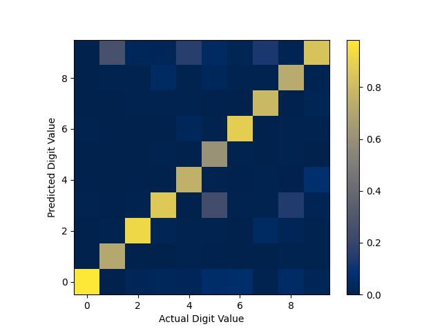

# SNN

## Project Description

This repository contains Python code with classes and functions for constructing and testing a spiking neural network. The spiking neural network is composed of two classes: an InhibitedNeuronLayer and a SynapseLayer, acting as the neurons and synaptic connections in the network respectively. Benchmarking of the network for unsupervised learning is done using the MNIST database of handwritten digits.

---
## Introduction to Spiking Neural Networks and Implemenation Details
Spiking neural networks are similar to standard neural networks save for a few key differences. The first of these differences is that they are temporal in nature. Input data is converted into spike trains, which are propagated to the rest of the network via synapses. The synapses connect neurons in the network which spike according to a leaky integrate-and-fire model. This models the potential $v$ of the neuron in the following way:

$$ \tau \frac{dv}{dt} = -v(t)+RI(t)\\quad v<v_{th}$$
$$ v(t)=0\\quad v\ge v_{th} $$

where $\tau$ is the relaxation time of the potential, $R$ is the neuron resistance, $I$ is the input current, and $v_{th}$ is the spiking threshold voltage. These spikes are transmitted through outgoing synapses to other neurons in the network, which integrate the resulting input current and fire if the threshold condition is met. After firing, $v_{th}$ is increased by some small amount $\theta$ and decays back to its starting value over time.

The second difference between spiking neural networks and traditional neural networks is that they do not learn via gradient descent. Instead, they learn through a local update rule which mirrors spike-timing dependent plasticity (STDP) in the brain. This code uses a simplified version of an STDP-derived learning rule: if an output neuron spikes within some window of an input neuron spiking, the synaptic weight $g$ will be increased by $\Delta g_p$. Otherwise, output spikes will decrease synaptic weight by $\Delta g_d$. This is described in the figure below assuming a spike window of 10 ms, $\Delta g_p$=0.1 S, and $\Delta g_d$=-0.05 S.

The behavior of $\Delta g_p$ and $\Delta g_d$ is described via the following equations:

$$\Delta g_p=\alpha_p\exp{-\beta_p\frac{g-g_{min}}{g_{max}-g_{min}}}$$
$$\Delta g_d=\alpha_d\exp{-\beta_d\frac{g_{max}-g}{g_{max}-g_{min}}}$$

where $\alpha$ is a learning rate, $\beta$ is a linearity parameter, the $p$ subscript indicates potentiation, and the $d$ subscript indictaes depression.

This implementation of a spiking neural network uses a 2-layer unsupervised paradigm. The network consists of an input layer of 784 neurons, fully connected to an output layer of $N$ neurons. To model lateral inhibition, the potential of all neurons in a given layer is reset to 0 when any neuron in the layer spikes.

---
## Results
Using 200 output neurons, $\theta=1$, $\alpha_p=0.001$, $\alpha_d=-0.0005$, $\beta_p=\beta_d=3$, the network was trained for 10 epochs. Each digit was presented for 350 ms, and each spike lasted 25 ms. The resulting confusion matrix is displayed below.

---
## Instructions

This code was written using Python 3.9.7. It requires the numpy (version 1.22.4 or better) and scikit-learn (version 1.6.1 or better) packages. To train the network, test the network on out-of-sample data, and print results including a confusion matrix for digit recognition, run 'SNN.py' in the command line. There are 8 command line arguments denoting hyperparameters of the network: 
1. The number of neurons in the output layer of the network
2. $\theta$ value for neurons in the network
3. Presentation time for each digit
4. Duration of each spike
5. Potentiation learning rate $\alpha_p$
6. Depression learning rate $\alpha_d$
7. Potentiation nonlinearity term $\beta_p$
8. Depression nonlinearity term $\beta_d$
Additionally, the number of training epochs can be tuned via the 'train_epochs' function in 'SNN.py'.
